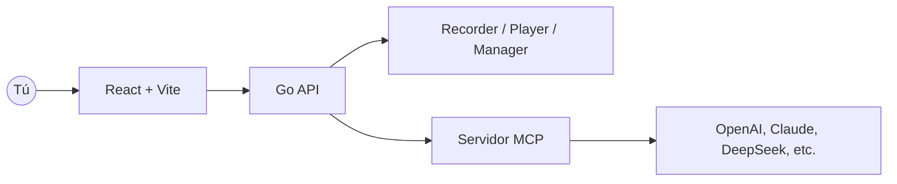

<div align="center" style="margin-top:12px">
  <div style="background:#fff;border:1px solid #eaecef;border-radius:12px;padding:16px 20px;display:inline-block;">
    <table style="border-collapse:collapse;">
      <tr>
        <td>
          <svg width="96" height="96" viewBox="0 0 28 28" fill="none" xmlns="http://www.w3.org/2000/svg" style="color:#0f172a">
            <g transform="rotate(-15 14 14)">
              <rect x="7" y="9" width="14" height="10" rx="2" stroke="currentColor" stroke-width="2" fill="none" />
              <line x1="9" y1="12" x2="19" y2="12" stroke="currentColor" stroke-width="1.2" stroke-linecap="round" />
              <path d="M7 13C5 12 3 11.5 1 12.5" stroke="currentColor" stroke-width="1.2" stroke-linecap="round" />
              <path d="M7 14.5C5.5 14 4 13.5 2.5 14" stroke="currentColor" stroke-width="1.2" stroke-linecap="round" />
              <path d="M7 16C6 15.5 5 15.5 4 16" stroke="currentColor" stroke-width="1.2" stroke-linecap="round" />
              <path d="M21 13C23 12 25 11.5 27 12.5" stroke="currentColor" stroke-width="1.2" stroke-linecap="round" />
              <path d="M21 14.5C22.5 14 24 13.5 25.5 14" stroke="currentColor" stroke-width="1.2" stroke-linecap="round" />
              <path d="M21 16C22 15.5 23 15.5 24 16" stroke="currentColor" stroke-width="1.2" stroke-linecap="round" />
            </g>
          </svg>
        </td>
        <td style="padding-left:16px; vertical-align:middle;">
          <h1 style="margin:0; font-size:46px; line-height:1; color:#0f172a">BrowserWing</h1>
        </td>
      </tr>
    </table>
  </div>
</div>

<p align="center">
  <a href="./README.md">English</a> · <a href="./README.zh-CN.md">简体中文</a> · <a href="./README.ja.md">日本語</a> · Español · <a href="./README.pt.md">Português</a>
</p>

<p align="center"><a href="https://browserwing.com">browserwing.com</a></p>

## Destacados

- Gestión del navegador: iniciar, controlar y persistir sesiones con cookies
- Grabación de scripts: capturar clics, entradas y navegación; edición visual
- Integración MCP: convertir scripts a comandos del Model Context Protocol
- Soporte de LLM: configurar OpenAI, Claude, DeepSeek, etc., para extracción

## Requisitos

- Google Chrome o Chromium instalado y accesible en el entorno.

## Inicio Rápido

### Opción A — Descargar Release (recomendado)

- Descarga el binario precompilado para tu sistema desde Releases.
- Ejecuta la app y abre `http://localhost:8080`.

```bash
# Linux/macOS
./browserwing --port 8080

# Windows (PowerShell)
./browserwing.exe --port 8080
```

### Opción B — Compilar desde código fuente

```bash
# Instalar dependencias (requiere Go y pnpm)
make install

# Compilar binario integrado (frontend embebido)
make build-embedded
./build/browserwing --port 8080

# O compilar todos los targets y empaquetar
make build-all
make package
```

## ¿Por qué BrowserWing?

- Ecosistema activo y scripts enriquecidos para completar tareas rápidamente
- Diseño eficiente en tokens y rendimiento rápido
- Automatiza tareas web complejas con scripts reproducibles y fiables
- Con MCP, conecta acciones grabadas con flujos de trabajo de LLM
- Sesiones estables mediante gestión de cookies y almacenamiento
- Ideal para extracción de datos, RPA, pruebas y navegación con agentes

## Arquitectura



## Guía de Uso

1. Gestiona navegadores: inicia instancias, perfiles y cookies
2. Graba scripts: guarda pasos para reproducir y editar
3. Convierte a MCP: expón scripts como herramientas/comandos MCP
4. Llama con LLMs: orquesta la automatización del navegador vía MCP

## Contribuir

- Se aceptan issues y PRs. Incluye pasos de reproducción o motivación clara.
- Para nuevas funciones, abre una discusión con casos de uso y resultados esperados.

## Agradecimientos

- Inspirado por la automatización moderna del navegador, flujos de agentes y MCP.
## Licencia

- Licencia MIT. Consulta `LICENSE`.

## Aviso Legal

- No utilizar con fines ilegales ni para violar términos de sitios.
- Destinado solo para aprendizaje personal y automatización legítima.
