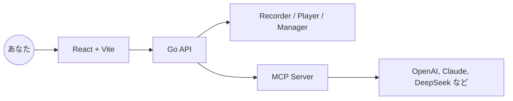

<div align="center" style="margin-top:12px">
  <div style="background:#fff;border:1px solid #eaecef;border-radius:12px;padding:16px 20px;display:inline-block;">
    <table style="border-collapse:collapse;">
      <tr>
        <td>
          <svg width="96" height="96" viewBox="0 0 28 28" fill="none" xmlns="http://www.w3.org/2000/svg" style="color:#0f172a">
            <g transform="rotate(-15 14 14)">
              <rect x="7" y="9" width="14" height="10" rx="2" stroke="currentColor" stroke-width="2" fill="none" />
              <line x1="9" y1="12" x2="19" y2="12" stroke="currentColor" stroke-width="1.2" stroke-linecap="round" />
              <path d="M7 13C5 12 3 11.5 1 12.5" stroke="currentColor" stroke-width="1.2" stroke-linecap="round" />
              <path d="M7 14.5C5.5 14 4 13.5 2.5 14" stroke="currentColor" stroke-width="1.2" stroke-linecap="round" />
              <path d="M7 16C6 15.5 5 15.5 4 16" stroke="currentColor" stroke-width="1.2" stroke-linecap="round" />
              <path d="M21 13C23 12 25 11.5 27 12.5" stroke="currentColor" stroke-width="1.2" stroke-linecap="round" />
              <path d="M21 14.5C22.5 14 24 13.5 25.5 14" stroke="currentColor" stroke-width="1.2" stroke-linecap="round" />
              <path d="M21 16C22 15.5 23 15.5 24 16" stroke="currentColor" stroke-width="1.2" stroke-linecap="round" />
            </g>
          </svg>
        </td>
        <td style="padding-left:16px; vertical-align:middle;">
          <h1 style="margin:0; font-size:46px; line-height:1; color:#0f172a">BrowserWing</h1>
        </td>
      </tr>
    </table>
  </div>
</div>

<p align="center">
  <a href="./README.md">English</a> · <a href="./README.zh-CN.md">简体中文</a> · 日本語 · <a href="./README.es.md">Español</a> · <a href="./README.pt.md">Português</a>
</p>

<p align="center"><a href="https://browserwing.com">browserwing.com</a></p>

## 特長

- ブラウザ管理：起動・制御・セッション永続化（Cookie など）
- スクリプト録画：クリック、入力、ナビゲーションを記録し、可視的に編集
- MCP 連携：スクリプトを Model Context Protocol コマンドに変換
- LLM 対応：OpenAI、Claude、DeepSeek などによる抽出・自動化


## 必要要件

- Google Chrome または Chromium がインストールされ、実行可能であること。

## クイックスタート

### 方法 A — リリース版をダウンロード（推奨）

- Releases から OS 向けのバイナリをダウンロードします。
- 実行後に `http://localhost:8080` を開きます。

```bash
# Linux/macOS
./browserwing --port 8080

# Windows (PowerShell)
./browserwing.exe --port 8080
```

### 方法 B — ソースからビルド

```bash
# 依存をインストール（Go と pnpm が必要）
make install

# 統合バイナリ（フロントエンドを埋め込み）
make build-embedded
./build/browserwing --port 8080

# すべてのターゲットをビルドしてパッケージ化
make build-all
make package
```

## なぜ BrowserWing なのか

- 活発なエコシステムと豊富なスクリプトで作業を迅速化
- トークン効率が良く、高速に動作
- 再生可能なスクリプトで複雑な Web 作業を自動化
- MCP により録画アクションを LLM ワークフローへ橋渡し
- セッションや設定を維持して安定した動作を実現
- データ抽出、RPA、テスト、エージェントブラウジングに最適

## アーキテクチャ



## 使い方

1. ブラウザ管理：インスタンス起動、プロファイル設定、Cookie 処理
2. スクリプト録画：手順を記録して再生・編集
3. MCP へ変換：スクリプトを MCP ツール/コマンドとして公開
4. LLM から呼び出し：MCP 経由でブラウザ自動化を編成

## コントリビューション

- Issue と PR を歓迎します。再現手順や動機を明確に記載してください。
- 機能提案はディスカッションで、ユースケースと期待結果を共有してください。

## 謝辞

- ブラウザ自動化、エージェントワークフロー、MCP にインスパイアされています。
## ライセンス

- MIT ライセンス。`LICENSE` を参照してください。

## 免責事項

- 違法目的やサイト規約違反に使用しないでください。
- 個人の学習および適法な自動化用途に限ります。
