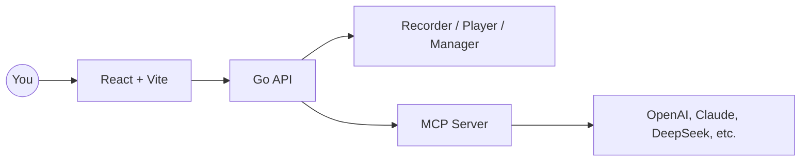

<div align="center" style="margin-top:12px">
  <div style="background:#fff;border:1px solid #eaecef;border-radius:12px;padding:16px 20px;display:inline-block;">
    <table style="border-collapse:collapse;">
      <tr>
        <td>
          <svg width="96" height="96" viewBox="0 0 28 28" fill="none" xmlns="http://www.w3.org/2000/svg" style="color:#0f172a">
            <g transform="rotate(-15 14 14)">
              <rect x="7" y="9" width="14" height="10" rx="2" stroke="currentColor" stroke-width="2" fill="none" />
              <line x1="9" y1="12" x2="19" y2="12" stroke="currentColor" stroke-width="1.2" stroke-linecap="round" />
              <path d="M7 13C5 12 3 11.5 1 12.5" stroke="currentColor" stroke-width="1.2" stroke-linecap="round" />
              <path d="M7 14.5C5.5 14 4 13.5 2.5 14" stroke="currentColor" stroke-width="1.2" stroke-linecap="round" />
              <path d="M7 16C6 15.5 5 15.5 4 16" stroke="currentColor" stroke-width="1.2" stroke-linecap="round" />
              <path d="M21 13C23 12 25 11.5 27 12.5" stroke="currentColor" stroke-width="1.2" stroke-linecap="round" />
              <path d="M21 14.5C22.5 14 24 13.5 25.5 14" stroke="currentColor" stroke-width="1.2" stroke-linecap="round" />
              <path d="M21 16C22 15.5 23 15.5 24 16" stroke="currentColor" stroke-width="1.2" stroke-linecap="round" />
            </g>
          </svg>
        </td>
        <td style="padding-left:16px; vertical-align:middle;">
          <h1 style="margin:0; font-size:46px; line-height:1; color:#0f172a">BrowserWing</h1>
        </td>
      </tr>
    </table>
  </div>
</div>

<p align="center">
  
  
  
  
  
  
</p>

<p align="center">
  English · <a href="./README.zh-CN.md">简体中文</a> · <a href="./README.ja.md">日本語</a> · <a href="./README.es.md">Español</a> · <a href="./README.pt.md">Português</a>
</p>

<p align="center"><a href="https://browserwing.com">browserwing.com</a></p>

## Highlights

- Browser management: launch, control, and persist sessions with cookies
- Script recording: capture clicks, inputs, navigations, and edit visually
- MCP integration: convert scripts to Model Context Protocol commands
- LLM support: configure OpenAI, Claude, DeepSeek and more for extraction

## Requirements

- Google Chrome or Chromium installed and accessible in your environment.

## Quick Start

### Option A — Download Release (recommended)

- Download the prebuilt binary for your OS from Releases.
- Run the app and open `http://localhost:8080`.

```bash
# Linux/macOS
./browserwing --port 8080

# Windows (PowerShell)
./browserwing.exe --port 8080
```

### Option B — Build from Source

```bash
# Install deps (Go + pnpm required)
make install

# Build integrated binary (frontend embedded)
make build-embedded
./build/browserwing --port 8080

# Or build all targets and packages
make build-all
make package
```

## Why BrowserWing

- Active ecosystem and rich scripts help you finish tasks fast
- Token-efficient design with fast performance
- Automates complex web tasks with reliable, replayable scripts
- Bridges recorded actions with LLM workflows via MCP commands
- Keeps sessions stable with cookie and storage management
- Designed for data extraction, RPA, testing, and agent-driven browsing

## Architecture



## Usage Guide

1. Manage browsers: start instances, configure profiles, handle cookies
2. Record scripts: capture steps and save for replay/editing
3. Convert to MCP: expose scripts as MCP tools/commands
4. Call with LLMs: let models orchestrate browser automation via MCP

## Contributing

- Issues and PRs are welcome. Please include clear steps to reproduce or a concise rationale.
- For feature ideas, open a discussion with use cases and expected outcomes.

## Acknowledgements

- Inspired by modern browser automation, agentic workflows, and MCP.
## License

- MIT License. See `LICENSE`.

## Disclaimer

- Do not use for illegal purposes or to violate site terms.
- Intended for personal learning and legitimate automation only.
