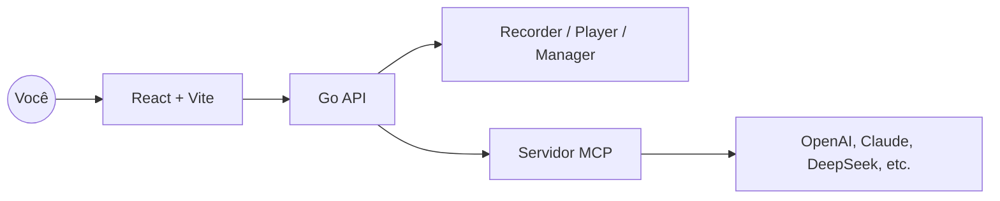

<div align="center" style="margin-top:12px">
  <div style="background:#fff;border:1px solid #eaecef;border-radius:12px;padding:16px 20px;display:inline-block;">
    <table style="border-collapse:collapse;">
      <tr>
        <td>
          <svg width="96" height="96" viewBox="0 0 28 28" fill="none" xmlns="http://www.w3.org/2000/svg" style="color:#0f172a">
            <g transform="rotate(-15 14 14)">
              <rect x="7" y="9" width="14" height="10" rx="2" stroke="currentColor" stroke-width="2" fill="none" />
              <line x1="9" y1="12" x2="19" y2="12" stroke="currentColor" stroke-width="1.2" stroke-linecap="round" />
              <path d="M7 13C5 12 3 11.5 1 12.5" stroke="currentColor" stroke-width="1.2" stroke-linecap="round" />
              <path d="M7 14.5C5.5 14 4 13.5 2.5 14" stroke="currentColor" stroke-width="1.2" stroke-linecap="round" />
              <path d="M7 16C6 15.5 5 15.5 4 16" stroke="currentColor" stroke-width="1.2" stroke-linecap="round" />
              <path d="M21 13C23 12 25 11.5 27 12.5" stroke="currentColor" stroke-width="1.2" stroke-linecap="round" />
              <path d="M21 14.5C22.5 14 24 13.5 25.5 14" stroke="currentColor" stroke-width="1.2" stroke-linecap="round" />
              <path d="M21 16C22 15.5 23 15.5 24 16" stroke="currentColor" stroke-width="1.2" stroke-linecap="round" />
            </g>
          </svg>
        </td>
        <td style="padding-left:16px; vertical-align:middle;">
          <h1 style="margin:0; font-size:46px; line-height:1; color:#0f172a">BrowserWing</h1>
        </td>
      </tr>
    </table>
  </div>
</div>

<p align="center">
  <a href="./README.md">English</a> · <a href="./README.zh-CN.md">简体中文</a> · <a href="./README.ja.md">日本語</a> · <a href="./README.es.md">Español</a> · Português
</p>

<p align="center"><a href="https://browserwing.com">browserwing.com</a></p>

## Destaques

- Gestão de navegador: iniciar, controlar e persistir sessões com cookies
- Gravação de scripts: capturar cliques, entradas e navegação; edição visual
- Integração MCP: converter scripts em comandos do Model Context Protocol
- Suporte a LLM: configurar OpenAI, Claude, DeepSeek e outros para extração

## Requisitos

- Google Chrome ou Chromium instalado e acessível no ambiente.

## Início Rápido

### Opção A — Baixar Release (recomendado)

- Baixe o binário pré-compilado para seu sistema em Releases.
- Execute o app e abra `http://localhost:8080`.

```bash
# Linux/macOS
./browserwing --port 8080

# Windows (PowerShell)
./browserwing.exe --port 8080
```

### Opção B — Compilar a partir do código

```bash
# Instalar dependências (Go e pnpm necessários)
make install

# Compilar binário integrado (frontend embutido)
make build-embedded
./build/browserwing --port 8080

# Ou compilar todos os targets e empacotar
make build-all
make package
```

## Por que BrowserWing

- Ecossistema ativo e scripts ricos para concluir tarefas rapidamente
- Design eficiente em tokens e desempenho rápido
- Automatiza tarefas web complexas com scripts reproduzíveis e confiáveis
- Com MCP, conecta ações gravadas a fluxos de trabalho de LLM
- Sessões estáveis com gerenciamento de cookies e armazenamento
- Ideal para extração de dados, RPA, testes e navegação com agentes

## Arquitetura



## Guia de Uso

1. Gerencie navegadores: instâncias, perfis e cookies
2. Grave scripts: salve passos para reprodução/edição
3. Converta para MCP: exponha scripts como ferramentas/comandos MCP
4. Chame com LLMs: orquestre automação do navegador via MCP

## Contribuindo

- Issues e PRs são bem-vindos. Inclua passos de reprodução ou motivação clara.
- Para novas funcionalidades, abra uma discussão com casos de uso e resultados esperados.

## Agradecimentos

- Inspirado por automação de navegador moderna, fluxos agentic e MCP.
## Licença

- Licença MIT. Veja `LICENSE`.

## Aviso

- Não use para fins ilegais ou violar termos de sites.
- Destinado apenas ao aprendizado pessoal e automação legítima.
