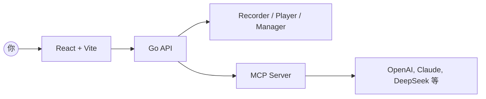

<div align="center" style="margin-top:12px">
  <div style="background:#fff;border:1px solid #eaecef;border-radius:12px;padding:16px 20px;display:inline-block;">
    <table style="border-collapse:collapse;">
      <tr>
        <td>
          <svg width="96" height="96" viewBox="0 0 28 28" fill="none" xmlns="http://www.w3.org/2000/svg" style="color:#0f172a">
            <g transform="rotate(-15 14 14)">
              <rect x="7" y="9" width="14" height="10" rx="2" stroke="currentColor" stroke-width="2" fill="none" />
              <line x1="9" y1="12" x2="19" y2="12" stroke="currentColor" stroke-width="1.2" stroke-linecap="round" />
              <path d="M7 13C5 12 3 11.5 1 12.5" stroke="currentColor" stroke-width="1.2" stroke-linecap="round" />
              <path d="M7 14.5C5.5 14 4 13.5 2.5 14" stroke="currentColor" stroke-width="1.2" stroke-linecap="round" />
              <path d="M7 16C6 15.5 5 15.5 4 16" stroke="currentColor" stroke-width="1.2" stroke-linecap="round" />
              <path d="M21 13C23 12 25 11.5 27 12.5" stroke="currentColor" stroke-width="1.2" stroke-linecap="round" />
              <path d="M21 14.5C22.5 14 24 13.5 25.5 14" stroke="currentColor" stroke-width="1.2" stroke-linecap="round" />
              <path d="M21 16C22 15.5 23 15.5 24 16" stroke="currentColor" stroke-width="1.2" stroke-linecap="round" />
            </g>
          </svg>
        </td>
        <td style="padding-left:16px; vertical-align:middle;">
          <h1 style="margin:0; font-size:46px; line-height:1; color:#0f172a">BrowserWing</h1>
        </td>
      </tr>
    </table>
  </div>
</div>

<p align="center">
  <a href="./README.md">English</a> · 简体中文 · <a href="./README.ja.md">日本語</a> · <a href="./README.es.md">Español</a> · <a href="./README.pt.md">Português</a>
</p>

<p align="center"><a href="https://browserwing.com">browserwing.com</a></p>

## ✨ 特性亮点

- 浏览器管理：启动、控制与会话持久化（Cookie 等）
- 脚本录制：点击、输入、导航等步骤捕获，并可视化编辑
- MCP 集成：将脚本转换为 Model Context Protocol 命令
- 大模型支持：配置 OpenAI、Claude、DeepSeek 等进行数据抽取

## ✅ 环境要求

- 环境中需安装 Google Chrome 或 Chromium，并可正常访问。

## 🚀 快速开始

### 方式 A — 下载 Release（二进制，推荐）

- 前往 Releases 下载对应操作系统的预构建二进制。
- 运行后打开 `http://localhost:8080`。

```bash
# Linux/macOS
./browserwing --port 8080

# Windows (PowerShell)
./browserwing.exe --port 8080
```

### 方式 B — 源码构建

```bash
# 安装依赖（需要 Go 与 pnpm）
make install

# 构建集成版本（前端嵌入后端）
make build-embedded
./build/browserwing --port 8080

# 或构建全部目标并打包
make build-all
make package
```

## 🤖 为什么选择 BrowserWing

- 活跃生态与丰富脚本，助你快速完成任务
- Token 友好、速度较快
- 以可回放脚本自动化复杂网页任务，稳定、可靠
- 通过 MCP 将录制动作桥接到 LLM 工作流
- 会话持久化与配置管理，避免频繁登录与失效
- 适用于数据抽取、RPA、测试与智能体驱动的浏览

## 🏗️ 架构



## 📖 使用步骤

1. 管理浏览器：启动实例、配置档案、处理 Cookie
2. 录制脚本：捕获步骤并保存用于回放/编辑
3. 转为 MCP：将脚本暴露为 MCP 工具/命令
4. LLM 调用：通过 MCP 让模型编排浏览器自动化

## 🤝 参与贡献

- 欢迎提交 Issue 和 PR，请附上复现步骤或清晰的动机。
- 新特性建议请在讨论区提出，描述使用场景与预期结果。

## 致谢

- 灵感源自现代浏览器自动化、智能体工作流与 MCP。
## 📄 许可证

- 采用 MIT 许可证，详见 `LICENSE`。

## ⚠️ 免责声明

- 请勿用于任何非法用途或违反网站条款的行为。
- 仅供个人学习与合规自动化使用。
